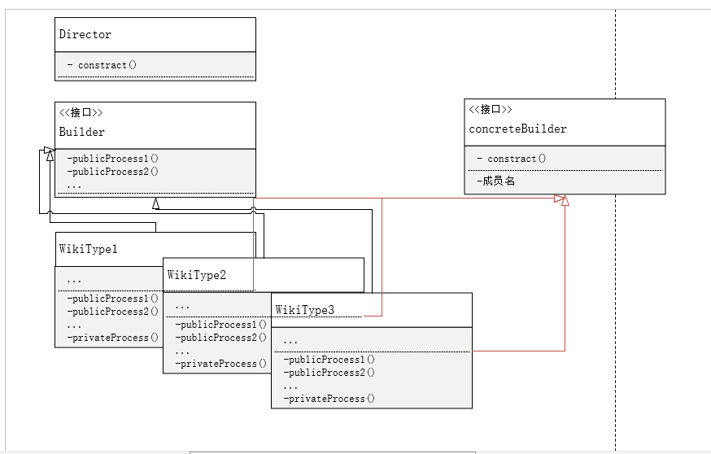

###问题背景
现有一个知识库，需要根据不同的创建类型 A,B,C，执行三种不同的初始化流程 processA,processB,processC。
流程中有相同的部分，也有各种类型定制的逻辑。
现在遇到两个问题

- 一种新的创建类型需要被支持
- 过去相同的流程中有不同的行为逻辑分支被隔离出来

传统的做法是在得到参数的时候根据三个分支进行相应的逻辑。
这么做的问题是当一种新类型被支持的时候需要重写相同的代码
遇到问题 2 的时候需要将分支的判断提前或者是从不同的地方重写

尝试使用一种新的设计模式

- 用抽象工厂产生具体的生产者，这样可以自定义生产者，让生产者身上的特性就和逻辑解耦依赖于抽象
- 再用主管去整合具体生产者
- 统一调用主管的构建去动态产生需要的类型 ABC

这种设计的好处在于将所有的修改都限定在自身，修改的时候只要对相应的类进行修改，可以在一定范围内解耦并控制逻辑。但是局限在于这种抽象

